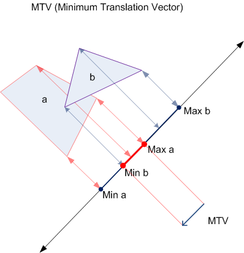
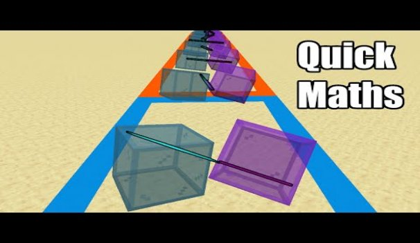

# Physics Engine
Dynamics
[^1]Chris Hecker treats impulse of rigid bodies as instantaneous, no integration or time step required, and links linear and angular velocity with this impulse equation

where e is restitution, 
vAB is relative velocity between the two rigid bodies,
n is collision normal
Ma and Mb are mass of rigid body A and B
rAP and rBP is the distance from center to collision point for rigid body A and B
IA and IB is inertia of rigid bodies A and B

Mass and Restitution of rigid body are stored as floats, while inertia is stored as 3x3 matrix (inertia tensor)

Collision Detection
Utilised Separating Axis Theorem that can detect collision for convex objects such as cubes.

Firstly, project vertices of the pair of rigid bodies to each of the testing axis 

In this example, using 2d triangles, the testing axes are the edges of the triangle making 6 testing axes, for 3d cubes 15 testing edges are required; 6 axes come from the 3-face normal of each cube, and  9 axes comes from the cross product of normals of each cube 
(3 normals from cube 1 x 3 normals from cube 2 = 9 axes)

Next for each testing axis, project vertices from both objects onto the axis, as long as for one testing axis there is no overlap between the vertices of each object, there is no collision (e.g, testing axis e3 from above example), if no collision exist

Another important thing is to retrieve the minimum separating axis (the testing axis that has the smallest distance between the two closest vertices of each object), the minimum separating axis and the distance forms the direction and magnitude of the minimum translation vector (MTV), a vector that represents the minimum distance and direction for 2 rigid body to move to not be in collision.

Collision Type
Next we need to identify collision type between two 3d cubes. There are 9 collision types for cubes that come from the permutation of vertex, edge, and face. However, to simplify this only face-vertex and edge-edge are used as firstly these 2 pairs covers most collision cases, and detection of these 2 collisions is[^2] provided by SAT. If minimum separating axis comes from face normal, it is a face-vertex collision, otherwise it is an edge-edge collision.

Collision Point
To get collision point, if collision is face-vertex, we just use the vertex as the collision point, but if it is an edge-edge collision, collision point is the halfway point of the minimum distance vector between the 2 edges.

Collision Normal
For Collision normal, to simplify things the Minimum Translation Vector is used since MTV is already used to shift the objects away from each other to resolve clipping, collision can just continue along the direction of the clipping shift
# Game Design & User Controls
There are two modes: Scout mode and Attack mode. You start in attack mode. **Press Q** to toggle between the modes.

- Attack Mode: You can rotate your camera and shoot birds anyway you like. However, you can’t move the position of your camera. Utilize this to attack the pigs that stole the eggs!
- Scout Mode: You can rotate your camera and move the position. Use WASD to move around. However, you can’t shoot any birds. You’ll know if you’re in scout mode when the background turns purple. Use this opportunity to plan your attack!

In both modes, you can **left click + drag** to rotate your camera view.

There are four types of birds: red bird (Red), yellow bird (Chuck), blue birds (Jim, Jack and Jay), and black bird (Bomb). **Right click** to shoot the bird. **Right click again** to trigger its ability. Here is the overview of their powers:

- Red: No powers. He’s a simple bird!
- Chuck: Gain a speed boost! Pierce through your enemies!
- Jim, Jack and Jay: Splits into three! The more the merrier!
- Bomb: Explode! Send objects flying! Wreak havoc!
# Sound
As OpenGL is a graphics library and doesn’t support audios, we used irrKlang to get audios to play sound effects for our game. The API is extremely simple and trivial like the following:

SoundEngine->play2D("audio/bgm.mp3", true);
# Final Product
A video of the final product can be seen here in this link:

<https://sutdapac-my.sharepoint.com/:v:/g/personal/aurelius_yuwana_mymail_sutd_edu_sg/ERY5mCkQMZ9DsAJ2fd26rrsBddH0rRBFKafAdS5mSsGq5w?nav=eyJyZWZlcnJhbEluZm8iOnsicmVmZXJyYWxBcHAiOiJPbmVEcml2ZUZvckJ1c2luZXNzIiwicmVmZXJyYWxBcHBQbGF0Zm9ybSI6IldlYiIsInJlZmVycmFsTW9kZSI6InZpZXciLCJyZWZlcnJhbFZpZXciOiJNeUZpbGVzTGlua0NvcHkifX0&e=B2yLar>
# Reference

[https://chrishecker.com/Rigid_Body_Dynamics

](https://chrishecker.com/Rigid_Body_Dynamics)[https://research.ncl.ac.uk/game/mastersdegree/gametechnologies/previousinformation/physics4collisiondetection/2017%20Tutorial%204%20-%20Collision%20Detection.pdf

](https://research.ncl.ac.uk/game/mastersdegree/gametechnologies/previousinformation/physics4collisiondetection/2017%20Tutorial%204%20-%20Collision%20Detection.pdf)<https://www.youtube.com/watch?v=EB6NY5sGd08>

[^1]: <https://chrishecker.com/Rigid_Body_Dynamics>

    
[^2]: <https://www.youtube.com/watch?v=EB6NY5sGd08&t=78s>

    